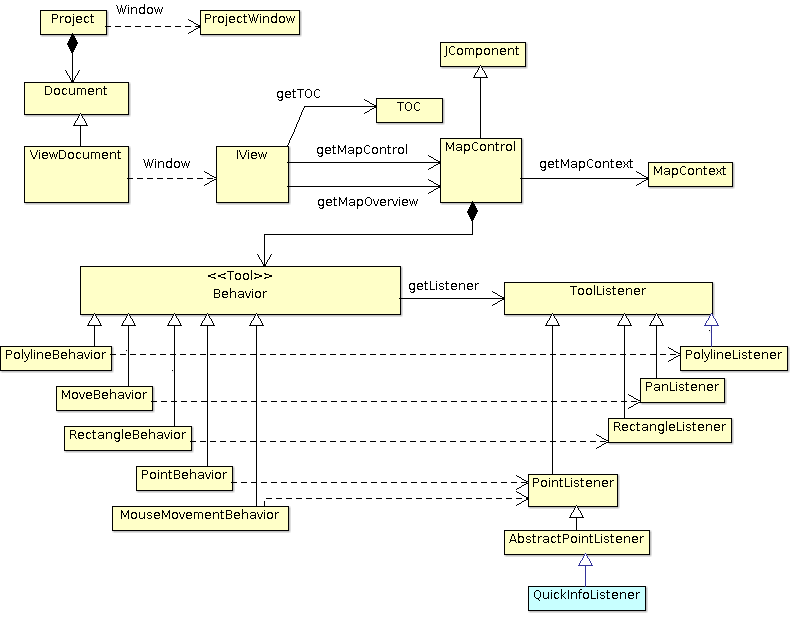
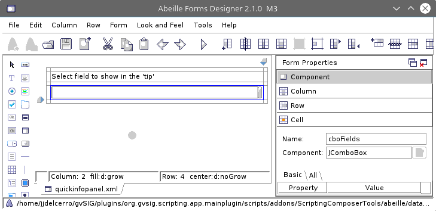

.. contents:: Contenidos

Qué necesitamos saber
========================

Para poder seguir este ejercicio es interesante:

- Que se conozca gvSIG a nivel de usuario.

- Que se tengan conocimientos de programación orientada a objetos,
  mejor si se conoce el lenguaje de programación python.

- Que se haya seguido la documentación básica sobre scripting que
  podemos encontrar en la web de gvSIG y se este mínimamente
  familiarizado con el editor de scripts.

  http://downloads.gvsig.org/download/web/es/build/html/scripting_devel_guide/2.3/index.html

  Muy importante haberle echado un vistazo a la sección de "Introducción"

  http://downloads.gvsig.org/download/web/es/build/html/scripting_devel_guide/2.3/introduccion.html

¿ Qué vamos a hacer ?
=========================

A la hora de plantearme un ejercicio de desarrollo como este, siempre me surge la duda de si
debo centrarme en el acceso y manipulación de datos, o hacer algo que interactúe más con gvSIG.
El acceso y manipulación de datos es bastante sencillo y hay muchos ejemplos en la documentación
de gvSIG. Así que en esta ocasión me he decidido por centrarme en algo que interactúe con gvSIG.
El problema es que gvSIG es más grande de lo que parece a primera vista y decidir qué hacer no
es nada simple. El "qué hacer" tendría que cubrir los siguientes puntos:

- Debería ser útil. Hacer algo que una vez terminado no sirve para nada no es
  muy alentador para el que sigue el ejercicio.
- Debería tocar suficientes cosas de gvSIG como para que pudiese ser usado, por
  lo menos en algunas de sus partes, en otros desarrollos.
- Debería poderse seguir con relativa facilidad, si se tienen conocimientos de
  programación orientada a objetos.
- Debería poder seguirse y completarse en un par de horas.

Con esto en mente, y después de darle algunas vueltas decidí preparar una pequeña funcionalidad
que consiste en:

  *"Desarrollar una herramienta de información rápida que muestre en un 'tip' sobre el mapa
  la información que configuremos para cada capa, y que ese 'tip' se vaya actualizando tal
  como vayamos moviendo el cursor del ratón sobre el mapa".*

Para esto, ¿ qué es lo que veremos ?

- Cómo crear una herramienta nueva para la vista.
- Cómo recuperar datos de una capa.
- Cómo añadir un botón y entrada de menú para nuestra herramienta.
- Cómo crear interfaces de usuario.
- Cómo añadir información al panel de propiedades de la capa.
- Cómo hacer que nuestro script se ejecute al iniciar gvSIG, y añada nuestra herramienta de
  forma automática.

No vamos a hacerlo todo de golpe. Iremos haciendo pequeños pedacitos de código que podamos ir
probando para al final cuando los juntemos tengamos nuestra funcionalidad completada.

Vamos a dividir el ejercicio en cinco partes:

- Añadir a la vista un *'tip'*. Nada configurable. Sin menús o botones para activarlo.
  Asumiremos que está cargada la capa *"manzanas_pob"* que viene con los
  scripts de ejemplo de gvSIG, y el "tip" mostrará la población de cada manzana
  sobre la que pasemos.

- Veremos cómo se añadiría un botón y una entrada de menú a gvSIG para activar la
  herramienta *"Añadir a la vista un 'tip'"*.

- Veremos cómo podemos hacer un panel que nos permita, dada una capa, configurar qué queremos
  mostrar de esta en el *'tip'*.

- Veremos cómo añadir el panel que hemos creado al dialogo de propiedades de la capa, así como
  dónde guardar las propiedades extra que precisemos.

- Por último veremos cómo juntamos todas las piezas.

Antes de empezar es conveniente que nos acostumbremos a que cuando vayamos a realizar desarrollos con
scripting que se integren con gvSIG arranquemos gvSIG desde la consola. Muchos mensajes que pongamos
y esperemos que salgan en la consola de scripting no saldrán en esta, y sí en la del sistema.

Añadir a la vista un 'tip'
=============================

Vamos a crear un script que nos presente un tip en la vista. Asumiremos que hay una
capa en concreto cargada en la vista, la capa "manzanas_pob" que viene con los scripts
de ejemplo de gvSIG. No añadiremos ningún botón ni entrada de menú, y haremos que el
*'tip'* muestre la cantidad de población que hay en cada manzana sobre la que dejemos
el puntero del ratón.

Lo primero que haremos será cargar la capa en la vista. Para ello, en el editor
de scripts iremos a la pestaña *"projects"* y *"Sistema"*, y allí a *"org.gvsig.scripting.mainplugin/data"* y
seleccionaremos *"manzanas_pob.shp"*. Se nos activará la opción de menú *"Herramientas->Load layer"*.
Le daremos para cargar la capa en la vista corriente.

Sacaremos la tabla de atributos de la capa y observaremos que tiene un campo *"pop_total"*.
Será el valor de este campo el que mostraremos en nuestro *'tip'*.

Antes de empezar a ver código veamos un poco las partes de gvSIG que vamos a necesitar.

Solo algunas ideas generales de forma muy rápida, solo para ver donde encaja lo que vamos a desarrollar:

En gvSIG tenemos *"el proyecto"*. Este tiene, por un lado la clase *Project* que representa y
mantiene los datos del proyecto, y por otro *ProjectWindow*, que representa la ventana que tiene
asociado el proyecto.

Un proyecto tiene documentos. Que pueden ser de varios tipos. En el caso que nos interesa, de
tipo *ViewDocument*, que representa a la vista. Y que tiene asociado una clase *IView* que representa
a la ventana de la vista. Esta ventana, *IView*, tiene un ToC, un localizador y un mapa. Estos están
representados por la clase *MapControl*, para el localizador y el mapa, y una clase *TOC* para el ToC.
Ahora mismo lo que nos interesa es el mapa, el *MapControl*.

Lo que nos interesa es cómo se añaden herramientas al *MapControl*.
Una "herramienta" está formada por dos componentes:

- Un **"Behavior"**. Es el encargado de recoger el input del usuario.
  Tenemos de varios tipos ya definidos en gvSIG y no suele ser normal
  tener que implementar nuevos. Por ejemplo, tenemos unos que recogen el
  punto en el que el usuario hace *"clic"*. Otro que permite al usuario
  indicar un rectángulo y recoge las coordenadas del rectángulo. Otros
  permiten recoger información sobre una polilínea o un polígono. Pero
  estos no hacen nada con la información que recogen del usuario. Se limitan
  a pasársela a su listener.

- Un **"Listener"**. Estos son de varios tipos según con que *behavior* queramos
  enlazarlos, y son los que operan con la información que recogió el
  *behavior*. Por ejemplo, en gvSIG tenemos un *RectangleSelectionListener*,
  que va asociado a un *RectangleBehavior*, y se encarga de hacer una selección
  con los datos que se encuentran en ese rectángulo.

Normalmente cuando vayamos a desarrollar una herramienta, implementaremos un
*listener* y lo asociaremos al *behavior* que nos interese.

En nuestro caso, usaremos el *behavior* *MouseMovementBehavior*, que lleva asociado un
listener de tipo *PointListener*. Así, tendremos que implementar un *PointListener*
que, con la información del punto que recibe, se encargue de calcular el valor del *tip*
que queremos presentar y asociarlo al *MapControl*.

Para implementar esto crearemos dos clases:

- La clase **QuickInfo**. Será una clase que almacena la información sobre
  la capa con la que trabaja, así como que información de la capa queremos
  presentar, es decir, que atributo vamos a presentar en el *tip*.

  Además de la información con la que va a trabajar nuestra herramienta también
  incluirá algunas operaciones más como:

  - Dame la información del *tip* para un punto dado *getTooltipValue*.

  - Asigna a este MapControl la herramienta.

- La clase **QuickInfoListener**, que responda a los eventos del usuario y
  fija el *tip* que el *MapControl* deberá mostrar.

Vamos a ver cómo quedan estas clases, primero la clase *QuickInfo*:

.. code-block:: python

  class QuickInfo(object):

    def __init__(self):
      self.__behavior = None
      self.__layer = None

    def getTooltipValue(self, point, projection):
      try:
        fieldName = "pob_total"
        store = self.__layer.getFeatureStore()
        query = store.createFeatureQuery()

        # Haremos un filtro espacial para localizar los
        # registros que intersecten con el punto sobre el que
        # esta el ratón.
        query.setFilter(SpatialEvaluatorsFactory.getInstance().intersects(point,
          projection,store))

        # Con que nos devuelva la primera linea es suficiente.
        query.setLimit(1)
        query.retrievesAllAttributes();
        l = store.getFeatures(query,100)
        if len(l) < 1:
          return ""
        return str(l[0].get(fieldName))
      except Exception, ex:
        print str(ex)

    def setTool(self, mapControl):
      #
      # Nos quedamos con nuestra capa de manzanas_pob
      self.__layer = mapControl.getMapContext().getLayers().getLayer("manzanas_pob")

      if not mapControl.hasTool("quickinfo"):
        #
        # Creamos nuestro "tool" asociando el MouseMovementBehavior con nuestro
        # QuickInfoListener.
        self.__behavior = MouseMovementBehavior(QuickInfoListener(mapControl, self))
        self.__behavior.setMapControl(mapControl)

        #
        # Le añadimos al MapControl la nueva "tool".
        mapControl.addBehavior("quickinfo", self.__behavior)

      #
      # Activamos la tool.
      mapControl.setTool("quickinfo")

De la clase esta solo resaltar un par de cosas:

- el método *getTooltipValue*. Revive el punto del sobre el que está el puntero
  del ratón., y el sistema de coordenadas en que está ese punto; normalmente será el
  sistema de coordenadas de la vista. Lo necesitamos por qué puede tener que
  reproyectarse el punto para compararlo con la información de la capa.

  ¿Qué hace este método?

  Se limita a crear una consulta, un *FeatureQuery*, filtrando por una condición
  espacial, recoger los resultados de esta consulta, y recuperar el valor del
  atributo que nos interesa.

  Para hacer la consulta de espacial, utiliza la clase *SpatialEvaluatorsFactory*,
  que nos permite automatizar la creación del query.

- El método *setTool*. Que crea una *tool* nueva, la asigna al *MapControl* que recibimos,
  y la activa.

Veamos como sería la clase *QuickInfoListener*:

.. code-block:: python

  class QuickInfoListener(AbstractPointListener):

    def __init__(self, mapControl, quickinfo):
      AbstractPointListener.__init__(self)
      self.mapControl = mapControl
      self.quickinfo = quickinfo
      self.projection = self.mapControl.getProjection()

    def point(self, event):
      p = event.getMapPoint()
      tip = self.quickinfo.getTooltipValue(p,self.projection)
      self.mapControl.setToolTipText(unicode(tip, 'utf-8'))

Como veis es sorprendentemente *"corta"*.
Cuando la creamos le pasamos una instancia de *QuickInfo*, y en su método *point*
se limita a recoger el punto sobre el que está el puntero del ratón, pasárselo al
método *getTooltipValue* y con el valor obtenido lo asigna como el tooltip del
*MapControl* (no olvidemos que un *MapControl* extiende de un *JComponent* de java
que tiene métodos para gestionar el manejo de *tooltips*).

Hasta aquí bastante sencillo. Ya solo nos quedaría por ver cómo lo probamos.
Podría ser algo como:

.. code-block:: python

  viewDoc = gvsig.currentView()
  viewPanel = viewDoc.getWindowOfView()
  mapControl = viewPanel.getMapControl()

  quickInfo = QuickInfo()
  quickInfo.setTool(mapControl)

La idea sería juntar todo esto en un script, pondríamos nuestras dos clase, y el código
anterior en la función *"main"*. Tendríamos un script *quickinfo* con algo como:

.. code-block:: python

  # encoding: utf-8

  import gvsig

  from org.gvsig.fmap.mapcontrol.tools.Behavior import MouseMovementBehavior
  from org.gvsig.fmap.mapcontrol.tools.Listeners import AbstractPointListener
  from org.gvsig.fmap.mapcontext.layers.vectorial import SpatialEvaluatorsFactory

  class QuickInfo(object):

    def __init__(self):
      self.__behavior = None
      self.__layer = None

    def getTooltipValue(self, point, projection):
      try:
        fieldName = "pob_total"
        store = self.__layer.getFeatureStore()
        query = store.createFeatureQuery()

        # Haremos un filtro espacial para localizar los
        # registros que intersecten con el punto sobre el que
        # esta el ratón.
        query.setFilter(SpatialEvaluatorsFactory.getInstance().intersects(point,
          projection,store))

        # Con que nos devuelva la primera linea es suficiente.
        query.setLimit(1)
        query.retrievesAllAttributes();
        l = store.getFeatures(query,100)
        if len(l) < 1:
          return ""
        return str(l[0].get(fieldName))
      except Exception, ex:
        print str(ex)

    def setTool(self, mapControl):
      #
      # Nos quedamos con nuestra capa de manzanas_pob
      self.__layer = mapControl.getMapContext().getLayers().getLayer("manzanas_pob")

      if not mapControl.hasTool("quickinfo"):
        #
        # Creamos nuestro "tool" asociando el MouseMovementBehavior con nuestro
        # QuickInfoListener.
        self.__behavior = MouseMovementBehavior(QuickInfoListener(mapControl, self))
        self.__behavior.setMapControl(mapControl)

        #
        # Le añadimos al MapControl la nueva "tool".
        mapControl.addBehavior("quickinfo", self.__behavior)

      #
      # Activamos la tool.
      mapControl.setTool("quickinfo")

  class QuickInfoListener(AbstractPointListener):

    def __init__(self, mapControl, quickinfo):
      AbstractPointListener.__init__(self)
      self.mapControl = mapControl
      self.quickinfo = quickinfo
      self.projection = self.mapControl.getProjection()

    def point(self, event):
      p = event.getMapPoint()
      tip = self.quickinfo.getTooltipValue(p,self.projection)
      self.mapControl.setToolTipText(unicode(tip, 'utf-8'))

  def main(*args):
    viewDoc = gvsig.currentView()
    viewPanel = viewDoc.getWindowOfView()
    mapControl = viewPanel.getMapControl()

    quickInfo = QuickInfo()
    quickInfo.setTool(mapControl)

Para probarlo cargaremos la capa de "manzanas_pob" en la vista, lanzaremos nuestro
script, y pasaremos el ratón por la vista a ver que sucede.

Añadir botones con nuestra herramienta
=========================================

Añadir botones o entradas de menú en gvSIG involucra dos entidades.

Por un lado necesitaremos disponer de una "Extension". Esta "extension" se encarga
principalmente de proporcionar el código asociado a nuestra herramienta, así
como mecanismos para determinar si nuestra herramienta debe estar visible y activa.

Por otro lado deberemos registrar una "ActionInfo". Esta se encarga de aglutinar
en un solo punto la información que pueda ser necesaria para asociar una acción
a un botón, o entrada de menú. Tiene un rotulo, un acelerador, un icono, un tooltip,
una descripción, y una "extension". De forma que con todo esto podemos, simplemente, asignarla
a un botón y este ya tiene toda la información necesaria para presentar el botón
y ejecutar la acción cuando se haga clic sobre el. Además la acción controla
si el usuario actual tiene o no permisos para ejecutarla.

gvSIG mantiene un registro de todas las acciones disponibles. Lo primero será registrar
nuestra nueva acción, y luego ya la asignaremos a los menús o botones.

Para crear nuestra acción, lo primero será implementar una "Extension". En nuestro caso
implementaremos una clase *QuickinfoExtension* que podría ser algo como:

.. code-block:: python

  class QuickinfoExtension(ScriptingExtension):
    def __init__(self):
      pass

    def isVisible(self):
      return True

    def isEnabled(self):
      layer = currentLayer()
      if not self.isLayerValid(layer):
        return False
      return True

    def execute(self,actionCommand, *args):
      actionCommand = actionCommand.lower()
      if actionCommand == "settool-quickinfo":
        layer = currentLayer()
        if not self.isLayerValid(layer):
          return
        viewPanel = currentView().getWindowOfView()
        mapControl = viewPanel.getMapControl()
        quickInfo = QuickInfo()
        quickInfo.setTool(mapControl)

    def isLayerValid(self, layer):
      if layer == None:
        return False
      if layer.getName() != "manzanas_pob":
        return False
      return True

Cosas a comentar. Básicamente debemos implementar tres métodos:

- **isVisible**. Este método debe devolver "True" cuando nos interese que
  esté visible nuestro botón o entrada de menú. De momento haremos que
  esté visible siempre.

- **isEnabled**. Determina cuando está habilitado o no nuestro botón.
  En este caso haremos que esté habilitado solamente cuando esté activa
  nuestra capa de "manzanas_pob".

- **execute**. Es este método el que se ejecutará cuando se pulse sobre
  nuestro botón. Ahora bien, una *"extension"* puede gestionar varias
  acciones; para discernir qué acción es la que ha de ejecutarse, se recibe
  como parámetro el nombre de la acción. Aquí hemos asumido que nuestra acción
  se llama *"tools-quickinfo"*, así que lo primero que hace es comprobar de
  qué acción se trata.

Tanto el método *isEnabled* como *execute*, lo primero que hacen es comprobar
que nuestra capa, *"manzanas_pob"* esté activa en la vista corriente. Si no lo
está, no se habilita nuestra herramienta ni se ejecuta nada.

Nuestra herramienta, *QuickInfo*, requería para poder activarla, un *MapControl*,
así que, una vez hechas las verificaciones oportunas, obtendremos el *MapControl*
asociado al mapa de la vista, crearemos nuestra herramienta y le diremos que se
añada al *MapControl*:

.. code-block:: python

  viewPanel = currentView().getWindowOfView()
  mapControl = viewPanel.getMapControl()
  quickInfo = QuickInfo()
  quickInfo.setTool(mapControl)

Bien, pues esto sería la parte de crear nuestra *"extension"*, ahora tendremos que
crear nuestro "acción".

Para crear nuestra acción, acudiremos al *ActionInfoManager*, que es el encargado
de crear acciones y mantener el registro de ellas. Obtendremos el manager con:

.. code-block:: python

  actionManager = PluginsLocator.getActionInfoManager()

La acción lleva asociado un icono, normalmente para presentarlo en el botón o
junto a la entrada de menú. Antes de crear la acción deberemos cargar y registrar
nuestro icono en el tema de iconos de gvSIG. Lo haremos con:

.. code-block:: python

  iconTheme = ToolsSwingLocator.getIconThemeManager().getCurrent()

  quickinfo_icon = File(join(dirname(__file__),"images","quickinfo.png")).toURI().toURL()
  iconTheme.registerDefault("scripting.quickinfo", "action", "tools-quickinfo",
   None, quickinfo_icon)

Luego ya podremos crear y registrar nuestra acción:

.. code-block:: python

  quickinfo_extension = QuickinfoExtension()
  quickinfo_action = actionManager.createAction(
    quickinfo_extension,
    "tools-quickinfo",    # Action name
    "Show quick info",    # Text
    "settool-quickinfo",  # Action command
    "tools-quickinfo",    # Icon name
    None,                 # Accelerator
    1009000000,           # Position
    "Show quick info"     # Tooltip
  )
  quickinfo_action = actionManager.registerAction(quickinfo_action)

Y una vez ya tenemos registrada nuestra acción podemos ver de añadirla a las barras
de botones o entradas de menús con:

.. code-block:: python

  # Añadimos la entrada "Quickinfo" en el menú herramientas
  application.addMenu(quickinfo_action, "tools/Quickinfo")
  # Añadimos el la acción como un botón en la barra de herramientas "Quickinfo".
  application.addSelectableTool(quickinfo_action, "Quickinfo")

Todo este proceso de crear nuestra acción y registrarla en menús o botones, lo
meteremos en un método *"selfRegister"*, (el nombre no es importante) para poder
invocarlo desde donde lo necesitemos.

Si metemos todo en un modulo *"actions"*, este podría quedar algo como:

.. code-block:: python

  # encoding: utf-8

  import gvsig

  import os.path

  from os.path import join, dirname

  from gvsig import currentView
  from gvsig import currentLayer

  from java.io import File

  from org.gvsig.app import ApplicationLocator
  from org.gvsig.andami import PluginsLocator
  from org.gvsig.scripting.app.extension import ScriptingExtension
  from org.gvsig.tools.swing.api import ToolsSwingLocator

  from quickinfo import QuickInfo

  class QuickinfoExtension(ScriptingExtension):
    def __init__(self):
      pass

    def isVisible(self):
      return True

    def isLayerValid(self, layer):
      if layer == None:
        print "### QuickinfoExtension.isLayerValid: None, return False"
        return False
      if layer.getName() != "manzanas_pob":
        return False
      return True

    def isEnabled(self):
      layer = currentLayer()
      if not self.isLayerValid(layer):
        return False
      return True

    def execute(self,actionCommand, *args):
      actionCommand = actionCommand.lower()
      if actionCommand == "settool-quickinfo":
        print "### QuickinfoExtension.execute(%s)" % repr(actionCommand)
        layer = currentLayer()
        if not self.isLayerValid(layer):
          return
        viewPanel = currentView().getWindowOfView()
        mapControl = viewPanel.getMapControl()
        quickInfo = QuickInfo()
        quickInfo.setTool(mapControl)

  def selfRegister():
    application = ApplicationLocator.getManager()
    actionManager = PluginsLocator.getActionInfoManager()
    iconTheme = ToolsSwingLocator.getIconThemeManager().getCurrent()

    quickinfo_icon = File(join(dirname(__file__),"images","quickinfo.png")).toURI().toURL()
    iconTheme.registerDefault("scripting.quickinfo", "action", "tools-quickinfo",
      None, quickinfo_icon)

    quickinfo_extension = QuickinfoExtension()
    quickinfo_action = actionManager.createAction(
      quickinfo_extension,
      "tools-quickinfo",    # Action name
      "Show quick info",    # Text
      "settool-quickinfo",  # Action command
      "tools-quickinfo",    # Icon name
      None,                 # Accelerator
      1009000000,           # Position
      "Show quick info"     # Tooltip
    )
    quickinfo_action = actionManager.registerAction(quickinfo_action)

    # Añadimos la entrada "Quickinfo" en el menú herramientas
    application.addMenu(quickinfo_action, "tools/Quickinfo")
    # Añadimos el la acción como un botón en la barra de herramientas "Quickinfo".
    application.addSelectableTool(quickinfo_action, "Quickinfo")

  def main(*args):
    selfRegister()

He añadido un *"main"* para que podamos probar que se añade nuestra herramienta
como toca.

Creando nuestro panel
=========================

Recordemos cual sería la funcionalidad de nuestro panel.

Se trata de un panel que nos permita seleccionar el campo que queremos mostrar en
el 'tip' de nuestra herramienta. Más tarde usaremos este panel para añadirlo
a las propiedades de la capa. El panel va a ser muy sencillo, tan solo con una
etiqueta y un desplegable con los campos de la capa.

No voy a contar mucho sobre la creación de interfaces gráficas con scripting, de esto
ya hay bastante en la documentación de la web:

  http://downloads.gvsig.org/download/web/es/build/html/scripting_devel_guide/2.3/interfaces_visuales.html

Así que me voy a centrar solo en uno de tres detalles.

- **Uno**, botones de aceptar y cancelar. Es muy corriente que en los ejemplos
  que veamos sobre creación de interfaces gráficos encontremos que se suele añadir
  botones como "Aceptar", "Cerrar", "Aplicar" o "Cancelar" a nuestros paneles.
  A priori parece lógico, de hecho lo que suele llamar la atención es cuando te
  dicen que mejor si no los incluyes. Pues bien, a pesar de ser bastante didáctico
  incluir ese tipo de botones en nuestros paneles, lo mejor es no hacerlo.
  En nuestro caso si los incluimos obtendríamos un efecto nada deseado.

  En gvSIG hay herramientas para presentar de forma uniforme un panel, añadiéndole
  estos botones, un rotulo de cabecera y hasta algún icono si lo consideramos oportuno.
  Ahora veremos cómo hacerlo.

- **Dos**, es recomendable que nuestro panel exponga métodos para poder acceder
  a los elementos que este recoge sin que quien los usa se vincule a si estos valores
  están en una caja de texto, un desplegable o una tabla. Este panel debe proporcionar
  al usuario una forma de seleccionar qué campo de la tabla queremos usar para mostrar
  en el tip, así que le añadiremos un método *"getFieldName"* para poder obtener el
  valor que selecciono el usuario.

- **Tres**, ¿ cómo y dónde podemos guardar los datos introducidos por el usuario ?
  Pues a priori puede parecer mas complicado de lo que es. La capa implementa el interface
  *ExtendedPropertiesSupport* que nos provee de dos métodos:

  - *setProperty(name, value)*, que nos permite guardar un valor arbitrario en la
    capa asociado al nombre *name*.

  - *getProperty(name)*, que nos permite recuperar el valor de nombre *name* que
    esté asociado a la capa.

  Conviene que los valores sean valores numéricos o de cadena, y no objetos complejos.
  No es que no puedan almacenarse objetos complejos, pero para los valores *simples*
  gvSIG se encarga de persistirlos automáticamente cuando se guarda el proyecto, mientras
  que para objetos complejos deberíamos hacer algo más de faena para que se persistieran.

Para crear un *"panel"*, deberemos hacer básicamente dos cosas:

- Crear un modulo y en él una clase que extienda de *FormPanel*.
- Crear la definición del panel usando el *Abeille form designer*.

Crearemos un modulo *"quickinfopanel"*, y en él meteremos la clase:

.. code-block:: python

  class QuickinfoPanel(FormPanel):
    pass

Y luego con el *Abeille* crearemos en interface de usuario, que podría ser
algo como:

Tan solo una etiqueta y un *JComboBox*. Lo más importante es el nombre que le demos
al *JComboBox*, en nuestro caso *cboFields*.

La clase *QuickinfoPanel* podría quedar algo como:

.. code-block:: python

  class QuickinfoPanel(FormPanel):
    def __init__(self, layer=None):
      FormPanel.__init__(self,getResource(__file__,"quickinfopanel.xml"))
      self.setLayer(layer)

    def setLayer(self, layer):
      self.__layer = layer
      if layer==None:
        self.cboFields.removeAllItems()
      else:
        self.fillCombo(
          self.cboFields,
          self.__layer.getFeatureStore().getDefaultFeatureType()
        )

    def getLayer(self):
      return self.__layer

    def getFieldName(self):
      name = self.cboFields.getSelectedItem()
      if name == None:
        return None
      name = name.strip()
      if name == "":
        return None
      return name

    def fillCombo(self, combo, featureType):
      combo.removeAllItems()
      combo.addItem(" ")
      for attr in featureType:
        combo.addItem(attr.getName())
      x = self.__layer.getProperty("quickinfo.fieldname")
      if x in ("", None):
        combo.setSelectedIndex(0)
      else:
        combo.setSelectedItem(x)

    def save(self):
      self.__layer.setProperty(
        "quickinfo.fieldname",
        self.getFieldName()
      )

Tan solo cinco métodos. Un set/getLayer para asignarle la *layer* con la que
debe trabajar, el *getFieldName* que ya hemos comentado antes, un *fillCombo*
que se encargaría de rellenar el desplegable con los valores de los campos que
tiene la capa con la que estemos trabajando. Y un *save* que se encargaría de
guardar el campo seleccionado por el usuario como un valor asociado a la capa.

El panel, con esto, ya tiene todo lo que nos puede interesar, veamos ahora cómo
podríamos hacer para mostrarlo:

.. code-block:: python

  def main(*args):
    viewDoc = gvsig.currentView()
    layer = viewDoc.getLayer("manzanas_pob")
    panel = QuickinfoPanel(layer)

    winmgr = ToolsSwingLocator.getWindowManager();
    dialog = winmgr.createDialog(
      panel.asJComponent(),
      "Quickinfo test",
      "Quickinfo information",
      winmgr.BUTTONS_OK_CANCEL
    )
    dialog.show(winmgr.MODE.DIALOG)
    if dialog.getAction()==winmgr.BUTTON_OK:
      print "Ok"
      print "Show field: ", repr(panel.getFieldName())
      panel.save()
    else:
      print "Cancel"

Todo junto nuestro *"quickinfopanel"* quedaría algo como:

.. code-block:: python

  # encoding: utf-8

  import gvsig
  from gvsig import getResource
  from gvsig.libs.formpanel import FormPanel

  from org.gvsig.tools.swing.api import ToolsSwingLocator

  class QuickinfoPanel(FormPanel):
    def __init__(self, layer=None):
      FormPanel.__init__(self,getResource(__file__,"quickinfopanel.xml"))
      self.setLayer(layer)

    def setLayer(self, layer):
      self.__layer = layer
      if layer==None:
        self.cboFields.removeAllItems()
      else:
        self.fillCombo(
          self.cboFields,
          self.__layer.getFeatureStore().getDefaultFeatureType()
        )

    def getLayer(self):
      return self.__layer

    def getFieldName(self):
      name = self.cboFields.getSelectedItem()
      if name == None:
        return None
      name = name.strip()
      if name == "":
        return None
      return name

    def fillCombo(self, combo, featureType):
      combo.removeAllItems()
      combo.addItem(" ")
      for attr in featureType:
        combo.addItem(attr.getName())
      x = self.__layer.getProperty("quickinfo.fieldname")
      if x in ("", None):
        combo.setSelectedIndex(0)
      else:
        combo.setSelectedItem(x)

    def save(self):
      self.__layer.setProperty(
        "quickinfo.fieldname",
        self.getFieldName()
      )

  def main(*args):
    viewDoc = gvsig.currentView()
    layer = viewDoc.getLayer("manzanas_pob")
    panel = QuickinfoPanel(layer)

    winmgr = ToolsSwingLocator.getWindowManager();
    dialog = winmgr.createDialog(
      panel.asJComponent(),
      "Quickinfo test",
      "Quickinfo information",
      winmgr.BUTTONS_OK_CANCEL
    )
    dialog.show(winmgr.MODE.DIALOG)
    if dialog.getAction()==winmgr.BUTTON_OK:
      print "Ok"
      print "Show field: ", repr(panel.getFieldName())
      panel.save()
    else:
      print "Cancel"

Integrando el panel en las propiedades de la capa
====================================================

Vamos a ver ahora cómo podemos hacer para añadir nuestro panel a las pestañas de propiedades
de una capa. Para dar soporte a esto, en gvSIG tenemos tres clases:

- *PropertiesPageManager*. Es el encargado de gestionar y almacenar las distintas
  *páginas* de propiedades que usan los distintos diálogos de propiedades de gvSIG.

- *PropertiesPageFactory*. Por cada *tipo* de página de propiedades precisaremos
  dos clases, una factoría, que deberá extender de esta clase. Es la encargada de
  construir cuando es necesario el panel de propiedades y pasárselo al cuadro
  de dialogo de propiedades.

- *PropertiesPage*. Representa a la página de propiedades en sí misma, y es
  lo que crea la factoría *PropertiesPageFactory*.

Con esta idea en mente, deberemos crear dos clases, *QuickinfoPropertyPageFactory*, y *PropertiesPage*,
y registrar nuestra factoría en el *PropertiesPageManager*. Aunque parezca complicado,
vamos a ver como es relativamente simple. La factoría será algo como:

.. code-block:: python

  class QuickinfoPropertyPageFactory(PropertiesPageFactory):

    def __init__(self):
      pass

    def getName(self):
      return "Quickinfo"

    def getGroupID(self):
      return ViewDocument.LAYER_PROPERTIES_PAGE_GROUP

    def isVisible(self, layer):
      if isinstance(layer,VectorLayer):
        return True
      return False

    def create(self, layer):
      if not isinstance(layer,VectorLayer):
        return None
      return QuickinfoPropertyPage(layer)

Solo tiene cuatro métodos, pero todos ellos son importantes:

- *getName*. Devuelve el nombre con el que identificar a nuestra pagina
  de propiedades. Es un nombre interno y no pueden haber dos páginas de
  propiedades en el mismo *grupo* con el mismo nombre.

- *getGroupID*. Indica a qué grupo pertenece nuestra pagina de propiedades.
  En gvSIG tenemos varios grupos de páginas, por ejemplo, tenemos las páginas
  de propiedades del proyecto, o las de la vista, o en el caso que nos interesa
  las de la capa. Cuando se va a presentar el dialogo de propiedades de la capa,
  solo se usan las que el grupo sea *ViewDocument.LAYER_PROPERTIES_PAGE_GROUP*,
  que tiene el valor *"LayerPropertiesPageGroup"*.

- *isVisible*. Este método debe indicar si para la capa que recibe como parámetro
  esta página de propiedades debe o no estar visible. Nosotros solo mostraremos
  nuestra página para las capas vectoriales.

- *create*. Se encarga de crear la página de propiedades y asociarla a la capa
  que recibe como parámetro.

Visto en que consistiría la factoría, veamos que sería nuestra página de propiedades:

.. code-block:: python

  class QuickinfoPropertyPage(PropertiesPage):

    def __init__(self, layer=None):
      self.__panel = QuickinfoPanel(layer)

    def getTitle(self):
      return "Quickinfo"

    def asJComponent(self):
      return self.__panel.asJComponent()

    def getPriority(self):
      return 1

    def whenAccept(self):
      self.__panel.save()
      return True

    def whenApply(self):
      return self.whenAccept()

    def whenCancel(self):
      return True

Vemos que también tiene poquitos métodos y de una implementación bastante simple.
Vamos a repasarlos uno a uno:

- *getTitle*, que proporciona la etiqueta a mostrar en la pestaña.

- *getPriority*, que indica cómo de a la derecha o izquierda debe presentarse nuestra página
  entre las pestañas de propiedades de la capa. Cuanto más alto sea su valor
  más a la izquierda se posicionara.

- *asJComponent*, que devuelve el componente de gráfico a presentar en la pestaña de
  propiedades.

- *when...* que serán invocados cuando el usuario pulse en los botones de aceptar, aplicar
  o cancelar. Si devolvemos True, se continuará con la acción solicitada, mientras que
  si devolvemos False, la acción se cancelará.

Vistas ya las dos clases, solo queda ver como las registraríamos para que gvSIG las
use. Muy simple, nos limitaríamos a obtener el *PropertiesPageManager* y registrar en
el nuestra factoría:

.. code-block:: python

  def selfRegister():
    propertiesPageManager = MapControlLocator.getPropertiesPageManager()
    propertiesPageManager.registerFactory(QuickinfoPropertyPageFactory())

  def main(*args):
    selfRegister()

Igual que ya hicimos antes, meteremos el registro en un método *selfRegister* para
facilitarnos usarlo mas tarde.

Con esto crearemos un modulo *"quickinfopropertypage"* en el que lo meteremos todo, quedando
algo como:

.. code-block:: python

  # encoding: utf-8

  import gvsig

  from org.gvsig.propertypage import PropertiesPage
  from org.gvsig.fmap.mapcontext.layers.vectorial import VectorLayer
  from org.gvsig.app.project.documents.view import ViewDocument
  from org.gvsig.propertypage import PropertiesPageFactory
  from org.gvsig.fmap.mapcontrol import MapControlLocator

  from quickinfopanel import QuickinfoPanel

  class QuickinfoPropertyPage(PropertiesPage):

    def __init__(self, layer=None):
      self.__panel = QuickinfoPanel(layer)

    def getTitle(self):
      return "Quickinfo"

    def asJComponent(self):
      return self.__panel.asJComponent()

    def getPriority(self):
      return 1

    def whenAccept(self):
      self.__panel.save()
      return True

    def whenApply(self):
      return self.whenAccept()

    def whenCancel(self):
      return True

  class QuickinfoPropertyPageFactory(PropertiesPageFactory):

    def __init__(self):
      pass

    def getName(self):
      return "Quickinfo"

    def getGroupID(self):
      return ViewDocument.LAYER_PROPERTIES_PAGE_GROUP

    def isVisible(self, layer):
      if isinstance(layer,VectorLayer):
        return True
      return False

    def create(self, layer):
      if not isinstance(layer,VectorLayer):
        return None
      return QuickinfoPropertyPage(layer)

  def selfRegister():
    propertiesPageManager = MapControlLocator.getPropertiesPageManager()
    propertiesPageManager.registerFactory(QuickinfoPropertyPageFactory())

  def main(*args):
    selfRegister()

Juntándolo todo
================

Para terminar de armarlo todo, vamos a volver sobre algunos de los módulos que hemos
ido haciendo para tocar algunas cositas en ellos.

- En el modulo *"quickinfo"* vamos a cambiar un par de cosas.

  - Por un lado en el método *getTooltipValue* de la clase *QuickInfo*. Al principio
    comprobaremos si la capa tiene asignada la propiedad "quickinfo,fieldname". Si la
    tiene recuperaremos de ella el campo que vamos a mostrar, y si no, no saldremos
    devolviendo un None.

    .. code-block:: python

      def getTooltipValue(self, point, projection):
        try:
          fieldName = self.__layer.getProperty("quickinfo.fieldname")
          if fieldName in ("", None):
            print '### QuickInfo.getTooltipValue: %s return ""' % repr(fieldName)
            return ""

          store = self.__layer.getFeatureStore()

          ...

          if len(l) < 1:
            return ""
          return str(l[0].get(fieldName))

    - Por otro lado, el método *setTool* que usamos para activar la tool en la vista,
      en lugar de trabajar con una capa fija, trabajará con la capa activa, pero
      solo si tiene asignada la propiedad *"quickinfo.fieldname"*.

      .. code-block:: python

        def setTool(self, mapControl):
          actives = mapControl.getMapContext().getLayers().getActives()
          if len(actives)!=1:
            # Solo activamos la herramienta si hay una sola capa activa
            return
          fieldName = actives[0].getProperty("quickinfo.fieldname")
          if fieldName in ("", None):
            # Si la capa activa no tiene configurado el campo a mostrar
            # tampoco activamos la herramienta
            return
          self.__layer = actives[0]

          if not mapControl.hasTool("quickinfo"):

          ...

- En el módulo *"actions"* vamos a cambiar un par de cosas, similares a las que
  hemos cambiado en el *"quickinfo"*. Modificaremos el método de utilidad que añadimos
  *isLayerValid*, para que en lugar de comprobar si la capa es una en concreto
  verifique que la capa tiene en sus propiedades el valor *"quickinfo.fieldname"*:

  .. code-block:: python

    ...

    def isLayerValid(self, layer):
      if layer == None:
        return False
      fieldName = layer.getProperty("quickinfo.fieldname")
      if fieldName in ("", None):
        # Si la capa no tiene configurado el campo a mostrar
        # no activamos la herramienta
        return False
      return True

    ...

Con estos cambios ya casi lo tendríamos. Nos faltará solo una cosa...

**¿ Quién llamará y cuándo a los métodos *selfRegistry* para que nuestra herramienta
se integre en gvSIG ?**

Pues en gvSIG podemos crear scripts que se ejecuten en el arranque de la aplicación de forma automática.
Crearemos uno de estos scripts y en el llamaremos a las dos funciones *selfRegister* que
hemos implementado.

Para que un script se ejecute en el arranque de gvSIG, bastará con que se llame de una
forma especial, *"autorun"*. Así que simplemente crearemos nuestro script *autorun* con
el siguiente código:

.. code-block:: python

  # encoding: utf-8

  import gvsig

  import actions
  import quickinfopropertypage

  def main(*args):
    actions.selfRegister()
    quickinfopropertypage.selfRegister()

Es interesante tener en cuenta, que podemos deshabilitar un script para que no se ejecute,
esto es útil con los scripts *autorun* ya que nos permite hacer pruebas sin que se nos carguen
todas ellas en el arranque de gvSIG.

Un comentario más... tener en cuenta que parte de las cosas que estamos implementando quedan
registradas y cargadas en memoria en gvSIG al ejecutarse. Muchas veces no basta con corregir y volver a lanzar
nuestro script, por que lo que cargamos en la ejecución anterior aun está cargado. En estos casos
será necesario cerrar gvSIG y volver a arrancar para cerciorarnos que nuestras modificaciones son
correctas. En general, siempre es una buena practica cerrar gvSIG y volverlo a arrancar cuando
tengamos el trabajo concluido o casi concluido para cerciorarnos que funciona correctamente;
no vaya a ser que algo de lo que ejecutamos anteriormente esté haciendo funcionar las cosas
y al re-arrancar gvSIG no vayan.

Qué mas podemos añadirle
==========================

- Utilizar una expresión en lugar de un solo campo para determinar el valor
  a mostrar en el 'tip'-

- Dar soporte a internacionalización a nuestro código.
