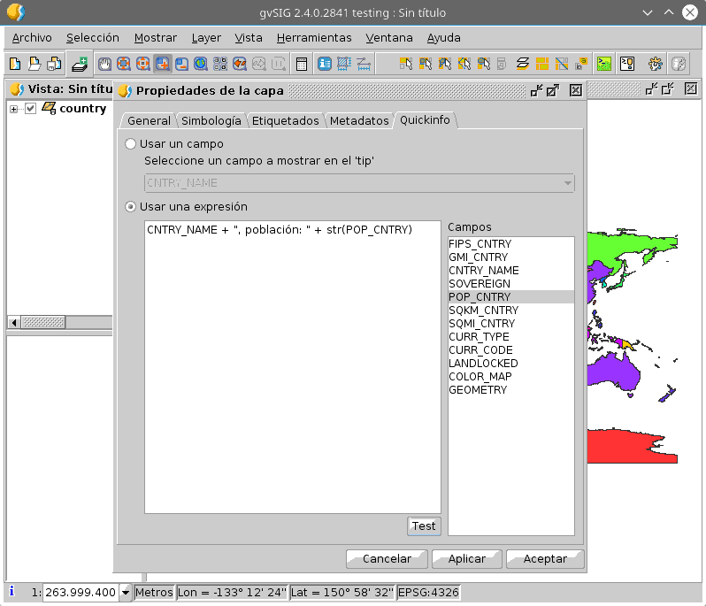
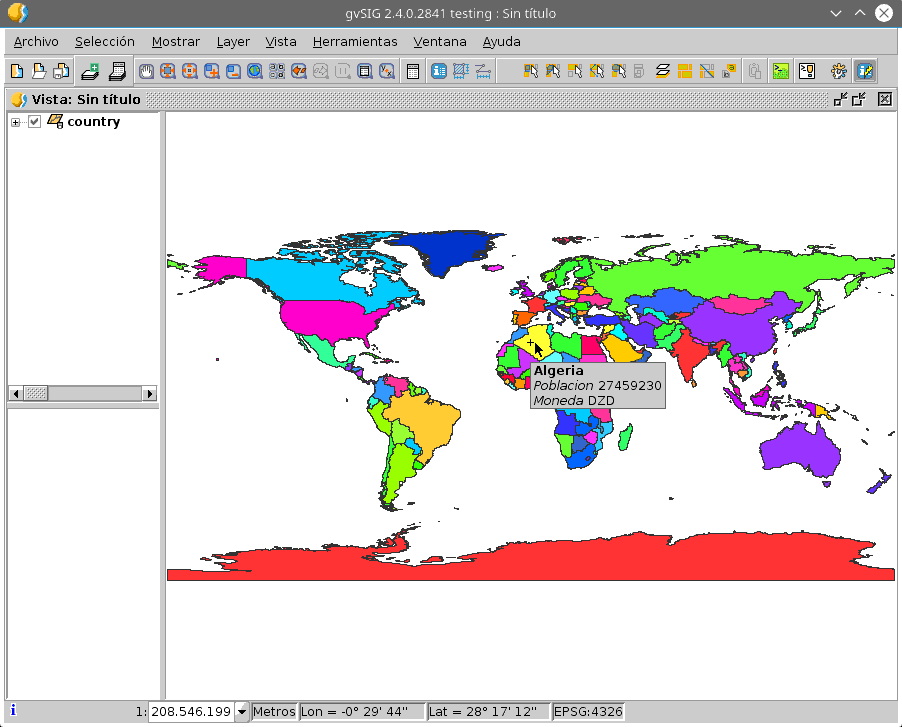

Descripción
================

Esta herramienta permite mostrar informacion de una capa vectorial que se va 
mostrando con forme se mueve el cursor del raton sobre la vista.

La herramienta añade un boton, |toolbaricon|, a la barra de botones de gvSIG, una
entrada de menu en el menu *Herramientas*, y una pestaña nueva, "Información rapida", 
al dialogo de propiedades de la capa.

Para usar la herramienta, lo primero es configurarla en *propiedades de la capa*.

En este dialogo podremos elegir entre:

- Usar el valor de un campo para mostrar como *tip* en la vista.

- Usar una expresion a evaluar para obtener el valor a mostrar como el *tip* de la vista.

  En este caso nos mostrara los capos de la capa que podemos usar para confeccionar
  nuestra expresion, asi como un boton *Test* que nos permitira comprobar la sintaxis
  de la expresion que hayamos introducido.
   
Una vez hayamos configurado el valor a mostrar en el *tip* de la vista para una capa,
podremos activar la herramienta a traves de la entrada de menu o del boton |toolbaricon|.
la informacion de *Información rapida* se mostrara para la capa activa al activar la
herramienta siempre que este configurada para ese capa.

La expresión se interpretara como una expresión de cadena. Podemos concatenar varios campos,
e incluso usar negritas o italicas tal como se muestra en la captura anterior. La expresión 
utilizada para obtener el *tip* de la captura anterior es::

  "<html>" +
  "<b>" + CNTRY_NAME + "</b> " +
  "<i>Poblacion</i> " + str(POP_CNTRY ) + " " +
  "<i>Moneda</i> " + str(CURR_CODE ) + " "  +
  "</html>"

En general si la cadena comienza por *"<html>"* y termina con *"</html>"* podra contener
secuencias HTML simples.

Información para desarrolladores
===================================

Esta herramienta se desarrolló como ejercicio para un *taller de desarrollo* con
gvSIG. En ese contexto, se preparo la documentacion para seguir el taller. Esta
puede encontrarse en el documento `quickinfo.rst <docs/quickinfo.html>`_. Si instalas
el plugin, dentro de la carpeta *docs* podras encontrar una version en PDF de este documento.

Ademas dentro de la carpeta de este script se encuentra una carpeta *approachs*, en 
la que se pueden encontrar los fuentes de las distintas partes que se comentan en 
la documentación del ejercicio:

- **approach1**, donde muestra como crear la parte de la *herramienta* que 
  presenta el *tip* en la vista. Sin nada de configuración y trabajando con 
  una capa en concreta.

- **approach2**, donde muestra como añadir botones y menus para activar
  la herramienta creada en el paso 1.

- **approach3**, donde muestra como crear un panel que luego
  usaremos para incrustar en el dialogo de propiedades de la capa.

- **approach4**, que muestra como crear una pestaña nueva en el dialogo
  de propiedades de la capa.
  
- **approach5**, que junta lo visto en los pasos anteriores para
  obtener la herramienta completa.

La herramienta que instala este script añade, a lo visto en el ejercicio,
la posibilidad de usar una expresion ademas de un campo para construir
el valor a mostrar en el *tip*, y el manejo de traducciones integrado
en el soporte multi-idioma de gvSIG.

